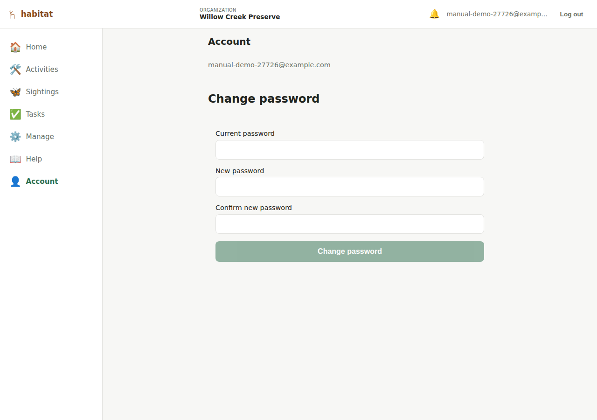

# Your account

The **Account** nav entry (`/account`) is where you manage your own login —
today, that's just changing your password. It's available to every logged-in
member regardless of role, since it only ever acts on your own account, not
anyone else's.

## Changing your password

Fill in:

- **Current password** — required, so someone who's grabbed your open
  session (but not your password) can't lock you out by changing it out
  from under you.
- **New password** and **Confirm new password** — must match, and must pass
  the same strength rules as signup (not too short, not too common, not
  entirely numeric).

You stay logged in after a successful change — no need to log back in.

If you don't remember your *current* password, this form can't help —
use **Forgot your password?** on the [login page](getting-started.md#forgot-your-password)
instead, which resets it via an emailed link rather than requiring the
old one. (See [Organization admin](organization-admin.md#adding-a-member)
for how a new member joins in the first place: via an emailed/shared
invite link, not a password an admin sets for them.)

---

[← Organization admin](organization-admin.md) · [Manual index](README.md) · [Public site →](public-site.md)
