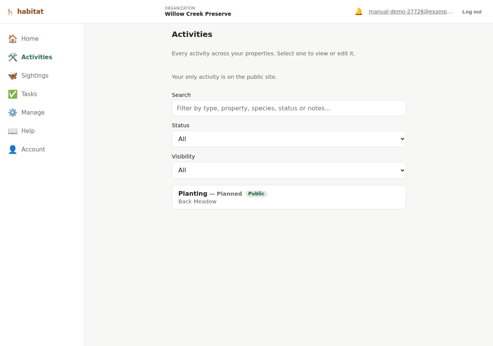

# Logging activities

An **activity** is restoration or management work done on a property — a
seeding, a planting, a treatment, and so on. Which kinds exist is up to
your organization; see [Activity types](organization-admin.md#activity-types).
Unlike a sighting (a single point), an activity is drawn as a **shape** —
the area the work covers.

## Creating an activity

There are two ways in. **Quick log** from the dashboard is the fast one —
draw the area on a full-screen map first and fill in the details after;
see [Quick log](dashboard.md#quick-log). The form below is the other, and
it's also what you get when you edit an existing activity.

From a property's map page, tap **+ Activity** (visible to editor role and
above). You'll draw the area the same way you draw a property boundary —
tap the map or **📍 Drop pin here** to add vertices, **Undo**/**Clear** to
fix mistakes. An activity's shape needs **at least 3 points** before it
can be saved (a property's boundary can be saved with none — an activity's
can't, since the shape *is* the record).

Fields:

- **Activity type** — one of your organization's own activity types.
  Every organization starts with eight (Seeding, Planting, Treatment,
  Removal, Monitoring, Maintenance, Intervention (general), Other), and an
  admin can rename them or add your own from
  [the admin page](organization-admin.md#activity-types).
- **Status** — drawn from your organization's own workflow states (see
  [below](#status-workflow)), not a fixed list.
- **Date planned** / **Date done** — both optional, independent dates.
- **Notes** — free text (conditions, quantities, follow-up needed, etc.).
- **Public flag** — "Show on the public site" — same public/private
  mechanism as a property or a sighting, and **ticked by default**. An
  activity left ticked, on a property that is itself public, is readable by
  anyone with the link — including its notes. See
  [what a public record publishes](public-site.md#what-a-public-record-publishes).

**After you save a new activity, Habitat offers a photo step** — an
**Add photos** screen with the same camera control the edit page uses.
Add as many as you like and press **Done**, or press **Skip**; either way
you land back on the property. Photos hang off a saved record, which is
why the step comes after saving rather than being a field on the form.

Species and linking to sightings are still **only available once the
activity is saved** (edit mode). Save the activity first, then reopen it
to edit.

## Status workflow

Every organization gets a default three-state workflow when it's created —
**Planned → In Progress → Done** — but the set of statuses is *your
organization's own*, not a fixed enum: exactly two of the states are
flagged specially (which one counts as the starting state and which
counts as finished work), and anything in between is up to you.

**You edit this set yourself**, in *Manage → Workflow states* — add,
rename, reorder, or delete states, and choose which one starts a new
activity and which counts as finished. See [Workflow
states](organization-admin.md#workflow-states) for the details, including
the one rule Habitat enforces: your workflow always needs at least one
state marked as finished work, because that's what tells the public map
and your dashboard which work is done.

## Finding an activity

The **Activities** nav entry lists every activity across all your
properties — one place to look when you can't remember which property a
piece of work was on.

- A **Search** box filters as you type, matching the activity type, the
  property name, its status, any species linked to it, and the notes.
- A **Status** dropdown narrows to **Planned / in progress** or
  **Completed**.
- A **Visibility** dropdown narrows to what is, or isn't, on the public
  site — see below.
- Selecting a row opens that activity's edit form.
- A line above the list says how many activities you have. Once any of the
  three controls above is narrowing the list it becomes "Showing 3 of 40."
  instead.

If your role is [scoped to specific
properties](roles-and-permissions.md), this list shows only the
activities on those properties.

### What's on the public site

Above the search box, the Activities page tells you how much of your work
is publicly visible — *"6 of 9 activities are on the public site."* — and
every row carries a badge saying which it is:

| Badge | What it means |
| --- | --- |
| **Public** | Anyone with the link can see this right now. |
| **Private** | You unticked *Show on the public site* on this activity. |
| **Property private** | The activity is marked public, but its property isn't — so nothing publishes it. |

That third one is worth knowing about, because it's the one that can
change without you touching the activity. Publishing a property puts
**every** public-marked record on it online at once, so if any of your
activities are in that state the page says so, with a count: *"3 more
activities are marked public and would go online if their property were
published."* Making a property private again takes them all back off (see
[The public site](public-site.md)).

Both flags have to be on. There is no cascade in either direction —
making a property private doesn't change any activity's own flag, it just
stops it being served.

## Editing an activity

Editor role and above. The edit form reopens with the drawn shape already
loaded and zoomed to.

### Who added this, and who changed it last

Just above the save button the form shows **"Added by …"** and, once
somebody has edited it, **"Last edited by …"**, each naming a person by
their email address. If the activity has only ever been saved by the
person who created it, only the first line appears.

This matters more than it looks, and it's worth knowing why. When you save
this form, Habitat writes back **every** field on it — type, status, both
dates, the notes, the public/private tick and the drawn shape — using the
values that were on screen when you opened the page. So if a colleague
changed the status while you had the form open, saving your typo fix will
quietly put the old status back. Habitat does not warn you about this and
does not merge the two edits. Seeing who touched it last is what lets you
notice and go and ask them; if the name isn't yours and the record matters,
reload the page before saving.

Someone whose account has been removed from the organization still shows
as the creator or editor of what they did. A record created before this
feature existed shows "Added by unknown".

**None of this appears on the public site** — a visitor sees the activity
itself, never who logged it. See [The public site](public-site.md).

### Photos

Once an activity exists, its edit page has a **Photos** section: a grid of
thumbnails plus a **+ Photo** control that opens your device's camera
(rear camera preferred on a phone) or file picker. Anyone with editor role
can upload; **removing** a photo requires **admin** role — treated as a
more destructive action than adding one. Photos are capped at 8MB each and
must be a **PNG, JPEG, WebP or GIF** — the formats a phone camera and an
ordinary screenshot produce. SVG is deliberately not accepted (see
[Limitations](limitations.md#records)).

Habitat keeps the file you uploaded exactly as you took it — nothing is
resized or re-compressed. Revisiting a page doesn't re-download photos
your browser already has.

**Click a thumbnail to see the photo full size.** The grid shows each
photo as a small square, and — because a square crop of a landscape or
portrait photo can only show its middle — most of the frame isn't visible
there at all. Clicking (or pressing Enter on) a thumbnail opens the whole
photo over the page:

- **← and →**, or the arrows either side of the counter, step through the
  other photos on that record. The counter reads "2 of 3" so you know
  where you are; the arrows grey out at the first and last photo rather
  than looping around.
- **Escape**, the **Close** button, or clicking the darkened area around
  the photo closes it and puts you back on the thumbnail you opened.

This costs no extra download — it's the same image the thumbnail already
fetched, shown uncropped instead of cropped.

(The screenshot below is from a sighting's edit
page, but the Photos section looks and works identically on an activity's.)

### Species

Also edit-mode-only: a **Species** section where you can record which of
your organization's species were involved — e.g. three species planted, or
one invasive species targeted by a treatment. Search for a species from
your account's [species list](species.md) by typing into the field (the
same type-to-filter picker used for [linking a sighting or
activity](linking-sightings-activities.md), not a long dropdown), then
optionally set a **role**
(Planted / Treated or targeted / Other), a **quantity**, and a free-text
**detail** (e.g. the method or product used). Add as many species as the
activity involves; each shows up as its own row with **Remove**, and
editor role and above can change its role/quantity/detail inline at any
time — changes save immediately, there's no separate "Save" step for this
section. The activity's row in the property's activity list shows a short
"Species: …" summary once at least one is recorded.

**Each species can only appear once on a given activity.** Adding one
that's already recorded is refused with "That species is already linked to
this activity" — if you need to record two different things about the same
species (say a different quantity), edit the existing row rather than
adding a second one. This holds even if two people add the same species to
the same activity at the same moment.

### Linked sightings

Also edit-mode-only — see
[Linking sightings and activities](linking-sightings-activities.md).

## Deleting an activity

Admin role only, from the property's map page (not the edit form) — each
activity row in the list has its own **Delete** button with a confirm
prompt.

**This one is permanent — there's no 30-day window and no restore view,
unlike [deleting a property](properties.md#deleting-a-property).** The
prompt says so, and if the activity has photos it counts them, because
they go with it:

> Delete this activity? Its 3 photos are deleted too. This can't be undone.

Photos are the only thing in Habitat you can't simply type in again, so
that count is the part worth reading. If the activity has none, the
prompt is just *"Delete this activity? This can't be undone."*

If the delete itself fails — a brief server restart, or the activity
already gone from another tab — the reason appears in red on that
activity's own card and the row stays put, so a delete that didn't
happen never looks like one that did. Deleting a single **photo** works
the same way: a failure is reported above the photo grid and the
thumbnail stays. Either message is announced to a screen reader as well
as shown, so a delete that quietly didn't happen isn't quiet for anyone.

---

[← Properties](properties.md) · [Manual index](README.md) · [Logging sightings →](sightings.md)
