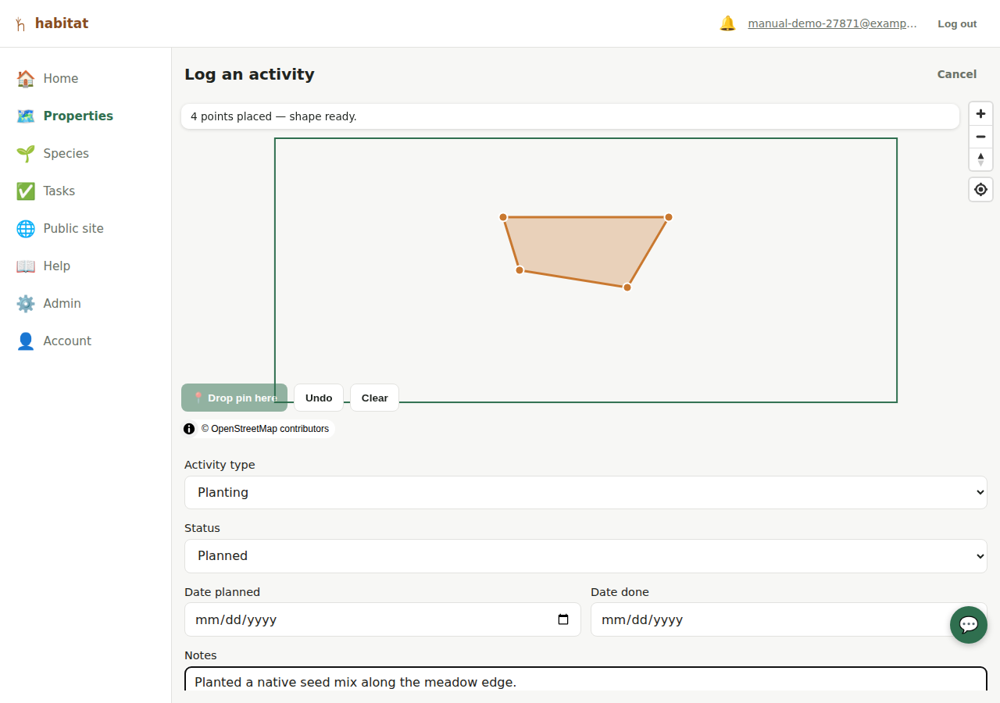
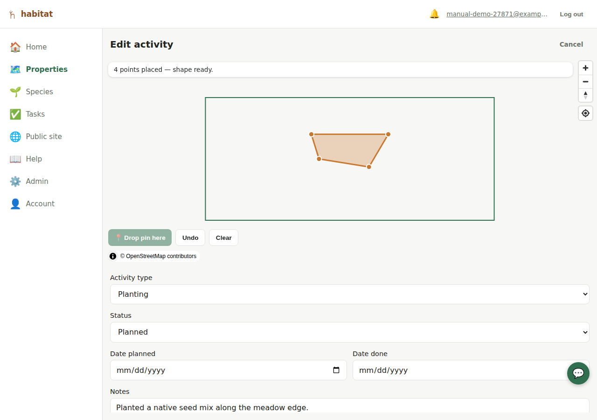
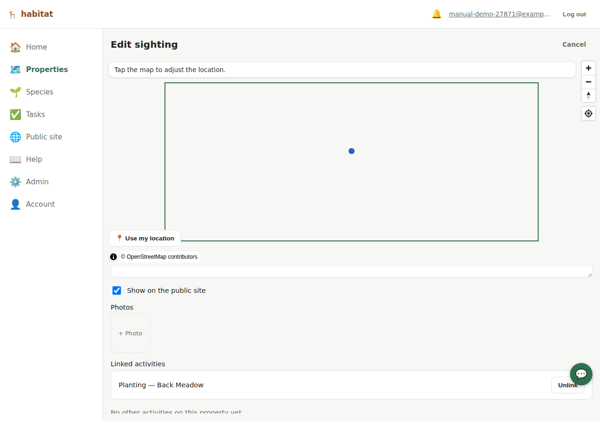

# Logging activities

An **activity** is restoration or management work done on a property — a
seeding, a planting, a treatment, and so on. Which kinds exist is up to
your organization; see [Activity types](organization-admin.md#activity-types).
Unlike a sighting (a single point), an activity is drawn as a **shape** —
the area the work covers.

## Creating an activity

There are two ways in. **Quick log** from the dashboard is the fast one —
draw the area on a full-screen map first and fill in the details after;
see [Quick log](dashboard.md#quick-log). The form below is the other, and
it's also what you get when you edit an existing activity.

From a property's map page, tap **+ Activity** (visible to editor role and
above). You'll draw the area the same way you draw a property boundary —
tap the map or **📍 Drop pin here** to add vertices, **Undo**/**Clear** to
fix mistakes. An activity's shape needs **at least 3 points** before it
can be saved (a property's boundary can be saved with none — an activity's
can't, since the shape *is* the record).

Fields:

- **Activity type** — one of your organization's own activity types.
  Every organization starts with eight (Seeding, Planting, Treatment,
  Removal, Monitoring, Maintenance, Intervention (general), Other), and an
  admin can rename them or add your own from
  [the admin page](organization-admin.md#activity-types).
- **Status** — drawn from your organization's own workflow states (see
  [below](#status-workflow)), not a fixed list.
- **Date planned** / **Date done** — both optional, independent dates.
- **Notes** — free text (conditions, quantities, follow-up needed, etc.).
- **Public flag** — "Show on the public view" — same public/private
  mechanism as a property or a sighting; see [Public site](public-site.md).

Photos, species, and linking to sightings are **only available once the
activity is saved** (edit mode) — there's nowhere to attach them to yet on
the create form. Save the activity first, then reopen it to edit.

## Status workflow

Every organization gets a default three-state workflow when it's created —
**Planned → In Progress → Done** — but the set of statuses is *your
organization's own*, not a fixed enum: exactly two of the states are
flagged specially (which one counts as "planned" and which counts as
"done"), and anything in between is up to you. There's currently no UI to
add/rename workflow *states* beyond the default set — that would need to
happen directly in the database (Django admin) today. (Activity **types**
are different: those you can edit yourself, see
[Activity types](organization-admin.md#activity-types).)

## Editing an activity

Editor role and above. The edit form reopens with the drawn shape already
loaded and zoomed to.

### Photos

Once an activity exists, its edit page has a **Photos** section: a grid of
thumbnails plus a **+ Photo** control that opens your device's camera
(rear camera preferred on a phone) or file picker. Anyone with editor role
can upload; **removing** a photo requires **admin** role — treated as a
more destructive action than adding one. Photos are capped at 8MB each and
must be an image file. (The screenshot below is from a sighting's edit
page, but the Photos section looks and works identically on an activity's.)

### Species

Also edit-mode-only: a **Species** section where you can record which of
your organization's species were involved — e.g. three species planted, or
one invasive species targeted by a treatment. Search for a species from
your account's [species list](species.md) by typing into the field (the
same type-to-filter picker used for [linking a sighting or
activity](linking-sightings-activities.md), not a long dropdown), then
optionally set a **role**
(Planted / Treated or targeted / Other), a **quantity**, and a free-text
**detail** (e.g. the method or product used). Add as many species as the
activity involves; each shows up as its own row with **Remove**, and
editor role and above can change its role/quantity/detail inline at any
time — changes save immediately, there's no separate "Save" step for this
section. The activity's row in the property's activity list shows a short
"Species: …" summary once at least one is recorded.

### Linked sightings

Also edit-mode-only — see
[Linking sightings and activities](linking-sightings-activities.md).

## Deleting an activity

Admin role only, from the property's map page (not the edit form) — each
activity row in the list has its own **Delete** button with a confirm
prompt.

---

[← Properties](properties.md) · [Manual index](README.md) · [Logging sightings →](sightings.md)
