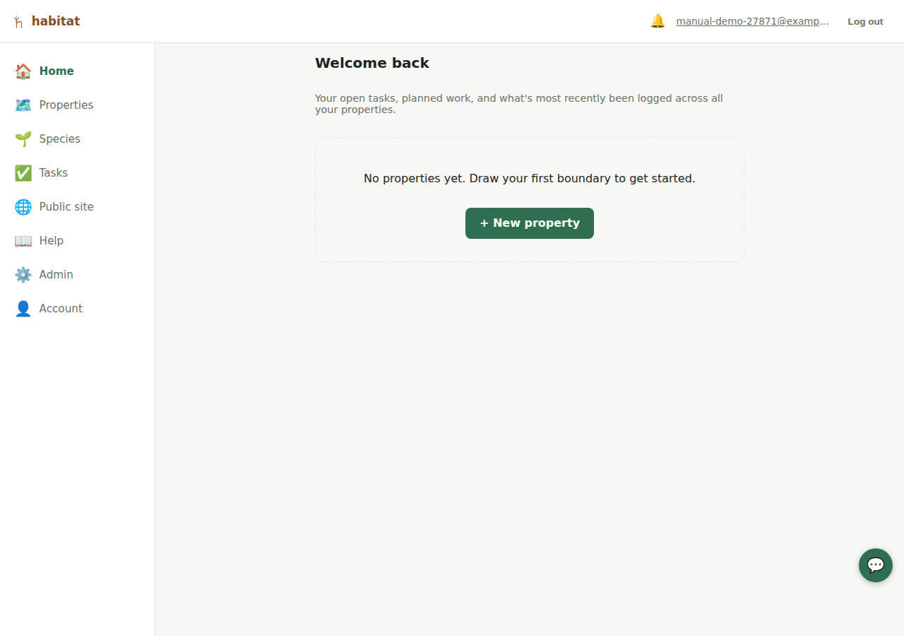
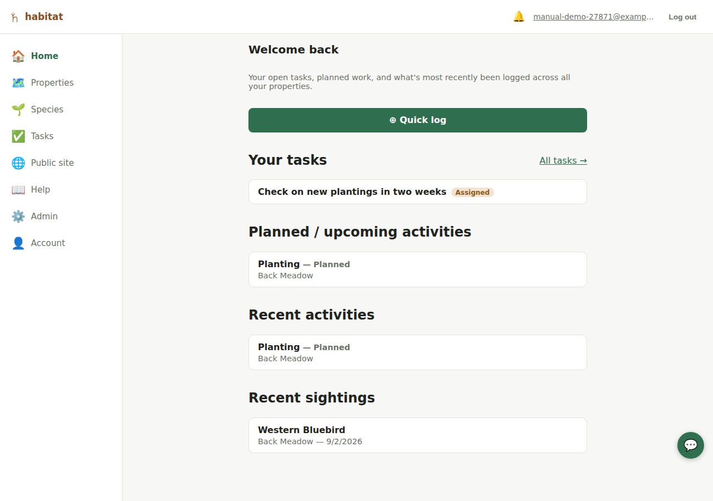
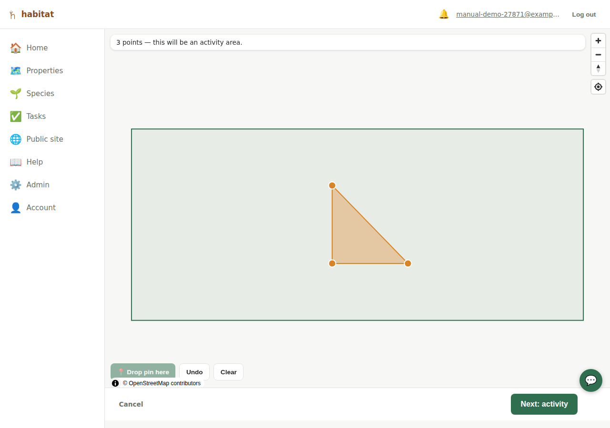

# Your dashboard

The page you land on right after logging in (or signing up) — `/`, also
reachable any time via **Home** in the nav — is a summary dashboard, not a
list of properties. It's meant to answer "what needs my attention" without
having to click into Tasks and every property one at a time.

For a brand-new organization with no properties yet, it's just a prompt to
draw your first one. Once there's real data, it shows up to four sections,
each linking out to the full page that actually handles it:

- **Your tasks** — open or assigned [tasks](tasks.md) assigned to *you*
  specifically (not the whole organization's task list), newest first, up
  to five. A link to **All tasks** goes to the full [Tasks](tasks.md)
  page. If nothing's assigned to you, this just says so — it doesn't show
  other people's tasks.
- **Planned / upcoming activities** — [activities](activities.md) that
  aren't marked done yet, across every property, soonest-planned-first.
  **This section only appears when there's at least one** — it's hidden
  entirely once everything's done, rather than showing an empty heading.
- **Recent activities** — the most recently logged activities across every
  property (regardless of status), newest first.
- **Recent sightings** — the most recently logged [sightings](sightings.md)
  across every property, newest first.

Each activity/sighting row links straight to that record's edit page (on
its own property), the same as opening it from the property's own map
page — the dashboard doesn't add a separate view of the data, just a
cross-property summary of what's already there.

## Quick log

**⊕ Quick log**, at the top of the dashboard, is the fast way to record
something you're standing in front of. It's the one action on an otherwise
read-only page, and it's built for logging on a phone out in the field:
the map gets the whole screen while you place the record, and the form
only appears afterwards.

**Where you tap decides what you're logging.** You don't pick a record
type first:

- **One point** → a [sighting](sightings.md).
- **Three or more points** → an [activity](activities.md), covering the
  area they enclose.
- Two points can't enclose an area and are too many for a sighting, so
  **Next** stays disabled until you add a third or undo back to one. The
  hint above the map tells you which you're currently heading for.

**Which property doesn't get asked either** — Habitat works it out from
where you tapped, and your property boundaries are drawn on the map so you
can see what you're standing on. If the spot isn't inside any of your
boundaries, the details step asks you to pick one (and for a sighting you
can leave it blank, which records a sighting with no property).

**📍 Drop pin here** places a point at your device's actual location, so
you can walk an area and drop a pin at each corner instead of tapping a
map you can't see well in daylight. **Undo** and **Clear** work the same
as they do on the drawing forms.

Then **Next** takes you to a short details step — species and time for a
sighting, type and status for an activity, plus notes and the public flag
for either — and saving drops you on the property that now holds the
record.

Two things to know:

- **Backing out discards the capture.** There's no saved draft; if you
  leave mid-flow you start again.
- **Photos, species on an activity, and linking records aren't here.**
  Quick log gets the record down fast; open it from the property
  afterwards to add the rest. The per-property **+ Activity** / **+
  Sighting** buttons and their full forms still exist and are unchanged —
  quick log is an extra way in, not a replacement.

## What this doesn't do (yet)

- Apart from Quick log, it's read-only — a summary, not another place to
  edit anything.
- "Recent" means *most recently logged* (when the record was created),
  not the activity's planned/done date or the sighting's observed-at
  time — those still show in each row's own detail.
- No per-user customization (reordering sections, changing how many rows
  show, dismissing a task from view without resolving it).

---

[← Getting started](getting-started.md) · [Manual index](README.md) · [Properties →](properties.md)
