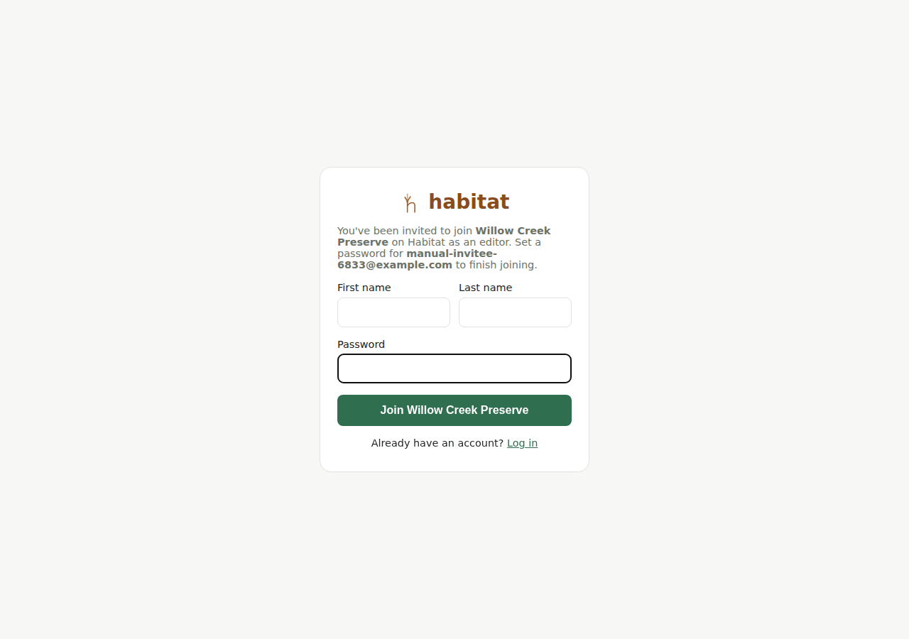

# Getting started

## Creating an account

Go to `/signup`. Habitat has no separate "individual" vs. "organization"
account type — every account you create is its own organization, even if
it's just you managing your own yard. Signing up does three things at
once:

1. Creates your user login (email + password).
2. Creates a new organization (name it anything — "your name, or your
   land's name" is the placeholder hint; you can rename it later from
   [organization admin](organization-admin.md)).
3. Makes you an **admin** of that new organization.

There's no email verification step and no social login (Google/etc.) —
just email and password.

## Joining an existing organization

If someone else's organization admin invites you (see [Organization
admin](organization-admin.md#adding-a-member)), you don't sign up the
usual way — you'll get an accept-invite link (by email, or shared with you
directly) that takes you to `/accept-invite/<a long token>`. That page
shows which organization and role you're joining and asks you to set a
password; submitting it creates your login and attaches you to *their*
organization instead of a brand-new one, then logs you straight in. An
invalid, expired (7 days), or already-used link shows a plain error
instead of a broken form.

## Logging in

`/login` — email and password. A logged-in session is a browser cookie
(Django session auth), not a token you copy around.

### Forgot your password?

Click **Forgot your password?** on the login page (`/forgot-password`),
enter your email, and submit. You'll always see the same confirmation
message — "If an account exists for that email, a reset link has been
sent" — whether or not that email actually has an account, so this can't
be used to check who has a Habitat login. If it does, you'll get an email
with a link (`/reset-password/<a long token>`) to set a new password; the
link expires after an hour and only works once. Real email delivery isn't
configured yet (see [Limitations](limitations.md)), so in a dev/test
setup that link only ever reaches the server's own console log, not an
actual inbox — the same current gap as the org-invite email (see
[Organization admin](organization-admin.md#adding-a-member)).

## Which organization am I in?

Right now, **the app doesn't have an org switcher**. If you're a member of
more than one organization, Habitat always uses whichever membership was
created first for you. In practice this only matters if someone adds you
to a second organization (see [organization admin](organization-admin.md))
— your own account's first org is unaffected. This is a known Phase 1
simplification, not a bug; see `/CLAUDE.md` if you're the one extending it.

## What you'll see after logging in

The app opens on your **[dashboard](dashboard.md)** — a summary of your
open tasks and recently-logged activities/sightings, not a bare list, plus
a **⊕ Quick log** button for recording a sighting or an activity straight
from a full-screen map. See that chapter for what it shows once there's
real data. From there, the nav has:

- **Home** — back to the dashboard, from anywhere. So is clicking the
  **habitat** logo in the top bar.
- **Activities** — [every activity across all your
  properties](activities.md#finding-an-activity), with a search box.
- **Sightings** — [the same for
  sightings](sightings.md#finding-a-sighting).
- **Tasks** — simple to-do assignment across the whole organization (not
  tied to one property).
- **Manage** — [your properties, species list, and organization
  settings](organization-admin.md). Everyone sees this entry; what's
  inside it depends on your role.
- **Help** — opens in a new tab; this manual, on GitHub. There's no
  in-app help viewer (yet) — it just links straight to the same
  `docs/manual/` you're reading right now.
- **Account** — [change your own password](account.md).

**Properties**, **Species** and **Public site** used to be their own nav
entries; they now live inside **Manage**. Activities and sightings are
still created and edited from a property's own page — the two new nav
entries are for *finding* one among many.

A 🔔 bell in the top bar shows notifications (currently just [task
assignments](tasks.md#notifications)), with an unread-count badge when
there's something new. On some Habitat instances you'll also see a small
floating feedback button in a corner — see
[Limitations](limitations.md#platform) for when that's present.

On a phone-width screen this navigation is a bottom tab bar; on a wider
screen it moves to a left sidebar. Nothing about what's available changes
between the two — it's the same app, just laid out differently.

What you can *do* on each of these pages — not just see — depends on your
role in the organization. See [Roles and permissions](roles-and-permissions.md).

---

[Manual index](README.md) · [Your dashboard →](dashboard.md)
