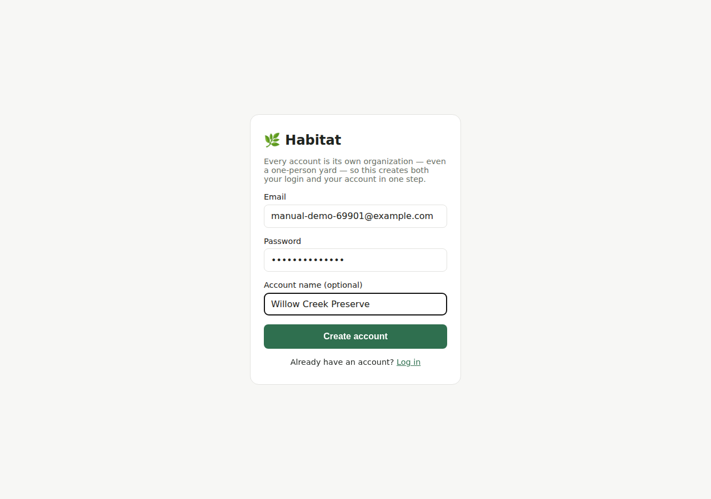
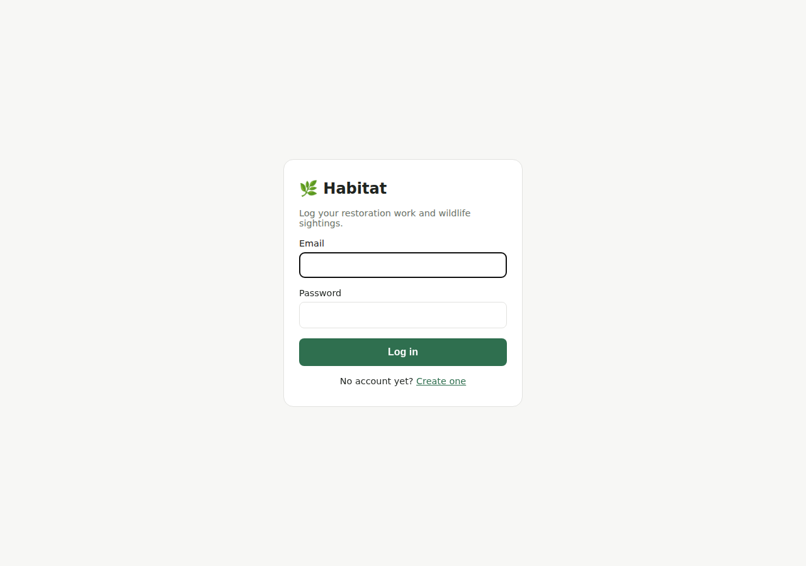
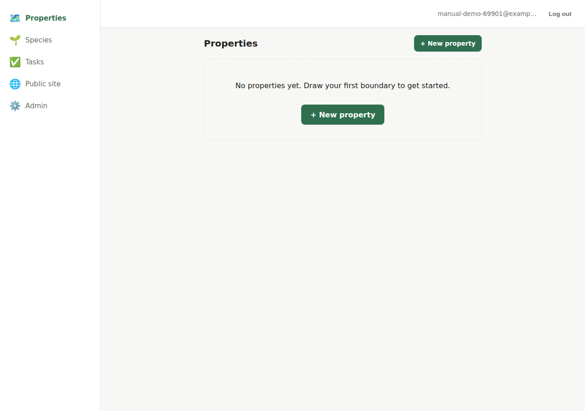

# Getting started

## Creating an account

Go to `/signup`. Habitat has no separate "individual" vs. "organization"
account type — every account you create is its own organization, even if
it's just you managing your own yard. Signing up does three things at
once:

1. Creates your user login (email + password).
2. Creates a new organization (name it anything — "your name, or your
   land's name" is the placeholder hint; you can rename it later from
   [organization admin](organization-admin.md)).
3. Makes you an **admin** of that new organization.

There's no email verification step and no social login (Google/etc.) —
just email and password.

## Logging in

`/login` — email and password. A logged-in session is a browser cookie
(Django session auth), not a token you copy around.

## Which organization am I in?

Right now, **the app doesn't have an org switcher**. If you're a member of
more than one organization, Habitat always uses whichever membership was
created first for you. In practice this only matters if someone adds you
to a second organization (see [organization admin](organization-admin.md))
— your own account's first org is unaffected. This is a known Phase 1
simplification, not a bug; see `/CLAUDE.md` if you're the one extending it.

## What you'll see after logging in

The app opens on **Properties** — a list of the properties (pieces of
land) your organization manages. From there:

- **Properties** — draw/view/edit land boundaries; each property's map
  page is where you log activities and sightings on it.
- **Species** — your organization's own species list.
- **Tasks** — simple to-do assignment across the whole organization (not
  tied to one property).
- **Public site** — opens in a new tab; the read-only, no-login view of
  your organization's public properties.
- **Admin** — only visible if you're an admin; organization settings and
  member management.

On a phone-width screen this navigation is a bottom tab bar; on a wider
screen it moves to a left sidebar. Nothing about what's available changes
between the two — it's the same app, just laid out differently.

What you can *do* on each of these pages — not just see — depends on your
role in the organization. See [Roles and permissions](roles-and-permissions.md).
