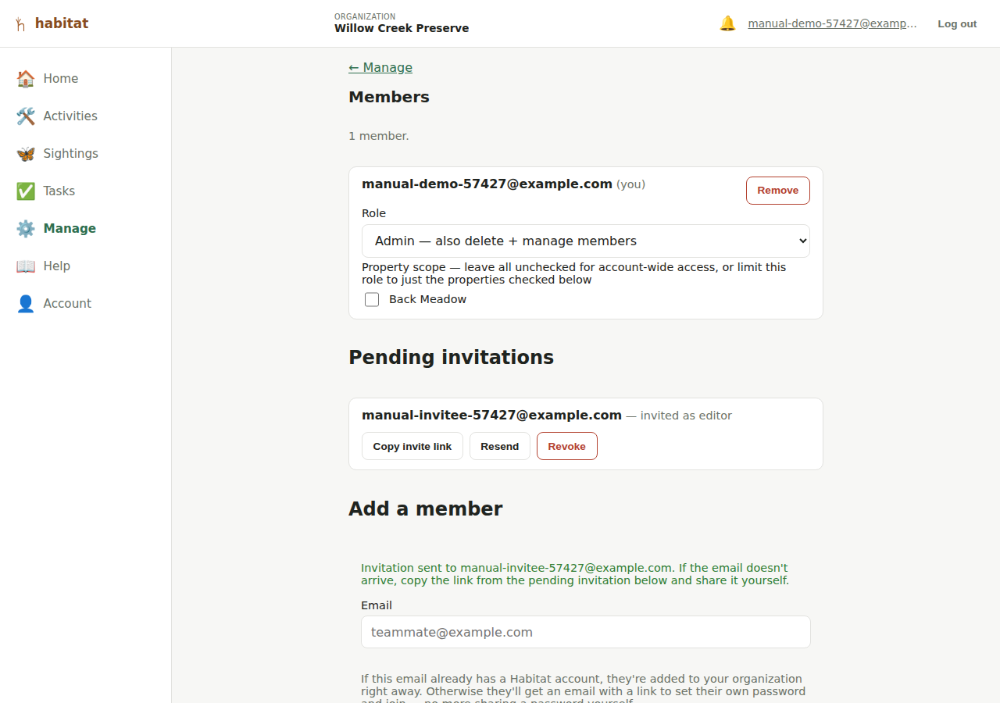

# Organization admin

The **Admin** nav entry (`/admin`) — visible only to members with the
admin role — is where your organization's own settings and membership
live. It's a page inside the app itself, scoped automatically to your own
organization, not Django's separate `/admin` site (which a developer might
use directly against the database, but which isn't org-aware and isn't
the intended path for day-to-day admin work).

A non-admin who navigates to `/admin` directly sees a plain "this page is
for organization admins only" message rather than being redirected away.

## Renaming your organization

A single **Organization name** field with its own **Save name** button.

## Choosing your public URL name

Below the name is a **Public URL name** field (a "slug") — the short,
readable part of your [public site](public-site.md) address. If your URL
name is `willow-creek-preserve`, your public portfolio lives at
`/public/willow-creek-preserve`, and each property sits under it (e.g.
`/public/willow-creek-preserve/north-meadow`).

- It's generated automatically from your organization name when the
  account is created, so there's always a working public URL without you
  doing anything.
- To change it, type a new one (lowercase letters, numbers, and hyphens)
  and press **Save URL name**. Leaving it blank and saving regenerates it
  from the current organization name.
- If the name you pick is already taken by another organization, or is a
  reserved word, you'll be asked to choose a different one.
- The older numeric-ID address keeps working too, so a link you shared
  before changing the URL name won't break.

## Public QR code

Under the URL name is a **Public QR code** generator — a scannable code
pointing at your organization's public site, for a sign, a flyer, or a
card.

- Press **Generate QR code** to create it, then **Download PNG** to save
  it.
- Optionally choose a **Center image** (e.g. your logo) to embed in the
  middle of the code before generating — the code uses a high
  error-correction level so it still scans with the image over it.
- Each property has its own QR code too, on the property's page (see
  [Properties](properties.md)).

## Theme

The **Theme** section lets an editor or admin brand your public site with
a fixed set of safe controls — not a free-form CSS field, deliberately:

- **Primary color, background color, and accent color** — click a swatch
  to pick a color, or **Reset to default** to go back to Habitat's normal
  styling for that one. Primary drives buttons and links; accent is a
  smaller highlight color used on the page-nav's active tab and your
  organization/property name heading.
- **Font** — a short list of safe font choices (Sans-serif, Serif,
  Rounded, Monospace), not a free-text font name.
- **Header image** — an optional banner shown at the top of your public
  pages. **Upload image** to add one, **Replace image** to swap it, or
  **Remove image** to go back to no banner.

Each property can set its own theme too (see [Properties](properties.md))
— any color a property leaves at its default falls back to your
organization's own setting, field by field, so a property only needs to
override the parts it actually wants to change.

## Pages

Your organization's public portfolio page (see
[Public site](public-site.md)) starts out as just a list of your public
properties — the built-in **Explore** page. The **Pages** section lets an
editor or admin write additional pages to tell a bigger story: press
**+ Add page**, give it a title and a body written in
[Markdown](https://www.markdownguide.org/basic-syntax/) (headings, bold/
italic, links, lists, images — no raw HTML or scripts; the body is
rendered and sanitized on the server before it's shown publicly), and
save.

Each page in the list can be edited, deleted, or hidden from the public
site (uncheck **Visible on the public site** on its edit form without
deleting it). The **Landing page** dropdown picks which page — Explore, or
one of your own — visitors see first at your organization's public URL;
Explore always stays reachable from the page nav on the public site
either way, so changing the landing page never hides it. A property has
its own, separate Pages section and landing page for its own public page —
see [Properties](properties.md).

## Members

The member list is visible to **any** member of the org (so even a viewer
can see who's on the team), but only admins can add, remove, or change
anyone.

### Adding a member

Fill in the **Add a member** form:

- **Email** (required)
- First/last name (optional)
- **Role** — viewer, editor, or admin (defaults to viewer)
- **Property scope** — optionally check specific properties to limit this
  member's role to just those (see [Roles and
  permissions](roles-and-permissions.md#property-scoped-roles) for the
  current enforcement caveat)

What happens next depends on whether that email already has a Habitat
account:

- **If it already has an account** (anywhere — it doesn't have to be in
  your org already), they're attached to your organization immediately
  with the role/scope you set. No invitation step, since they can already
  log in.
- **If it's a brand-new email**, Habitat creates a pending invitation and
  emails an accept link to it. The invitee opens the link, sets their own
  password, and lands in your organization with the role/scope you chose —
  no password to make up and share yourself.

> **No real email delivery is configured in this project yet** (see
> [Limitations](limitations.md)), so the email may never actually arrive.
> Every pending invitation also shows a **Copy invite link** button (see
> below) — if the invitee says they never got anything, copy that link and
> send it to them yourself (text, chat, whatever) instead.

### Pending invitations

A **Pending invitations** section appears between the member list and the
add-member form whenever your organization has any — each shows the
invited email, role, and property scope (if any), plus:

- **Copy invite link** — copies the same accept link the invitation email
  contains, for sharing manually.
- **Resend** — re-sends the invitation email using the *same* link (so a
  copy already shared or received still works), and resets its 7-day
  clock — the fix for an invitation that expired before anyone accepted
  it, without having to revoke it and fill out "Add a member" again from
  scratch.
- **Revoke** — cancels the invitation (with a confirm prompt) if it was
  sent to the wrong address or is no longer wanted. A revoked link stops
  working immediately.

An invitation also expires on its own after 7 days if nobody accepts it —
shown with an "(expired)" flag next to it rather than being removed, so
it stays visible to revoke or resend rather than silently vanishing. Once
accepted, it disappears from this list and the person shows up in
**Members** instead. See [Getting started](getting-started.md#joining-an-existing-organization)
for what the invitee sees when they open the link.

### Changing a member's role or property scope

Inline on each member's row — a role dropdown and a checkbox per property.
Changes apply immediately (no separate save button). Subject to the [last
admin protection](roles-and-permissions.md#the-last-admin-safety-rule).

### Removing a member

A **Remove** button per row, with a confirm prompt. Also subject to the
last-admin protection.

## Recently deleted

If your organization has any soft-deleted properties, a **Recently
deleted** section appears (below Pending invitations, above Add a
member) listing each one with when it was deleted and how many days
remain before it's purged for good (see [Properties](properties.md#deleting-a-property)
— deletion keeps a property, and its activities/sightings, for 30 days
before removing them permanently). Press **Restore** on a row to bring
it (and everything on it) back immediately. The section itself
disappears when there's nothing in the 30-day window.

## Feedback

If your organization has any [in-app feedback](limitations.md) submitted
by members (via the floating feedback button — only present when this
feature is turned on for your Habitat instance), a **Feedback** section
lists each submission with who sent it, when, and its status. Press
**Mark resolved** once you've actually addressed what it describes —
this is independent of whether it's already been picked up by the
project's own development workflow, which happens separately and isn't
something you need to do anything about here.

## Jumping to the public site

A **View public site ↗** link at the top of the page opens your
organization's [public portfolio page](public-site.md) in a new tab —
useful for checking what it actually looks like to someone who isn't
logged in.

---

[← Roles and permissions](roles-and-permissions.md) · [Manual index](README.md) · [Your account →](account.md)
