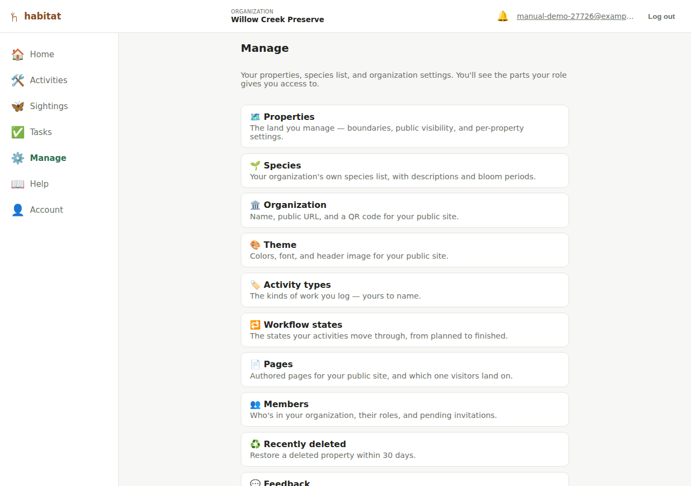

# Manage (organization admin)

The **Manage** nav entry (`/manage`) is where your properties, species
list, and your organization's own settings live. It's a menu: each entry
opens its own page, so you get the one thing you came for instead of one
very long page with everything on it.

**Everyone sees the Manage entry**, but what's inside depends on your
role. It always contains:

- **Properties** — [draw and edit land boundaries](properties.md).
- **Species** — [your organization's species list](species.md).
- **Public site** — opens the [public view](public-site.md) in a new tab.

Admins additionally get **Members** and **Recently deleted**, and
account-wide admins also get **Organization** (name, public URL name, QR
code), **Theme**, **Activity types**, **Workflow states**, **Pages** and
**Feedback**.

These are pages inside the app itself, scoped automatically to your own
organization — not Django's separate `/admin` site (which a developer
might use directly against the database, but which isn't org-aware and
isn't the intended path for day-to-day admin work).

If you open a Manage page your role doesn't cover — by typing its URL, or
from an old bookmark — you get a plain "you don't have access to this part
of Manage" message rather than a page whose buttons all fail.

**If your admin role is scoped to specific properties**, the Manage menu
is shorter: you get Members (covering the members scoped to your own
properties) and Recently deleted, while the organization-level settings
belong to an account-wide admin instead. See [Roles and
permissions](roles-and-permissions.md#what-a-property-scoped-admin-can-administer)
for exactly which members you can manage.

> **Moved from `/admin`.** This section used to be a single admin-only
> page at `/admin`. Old links still work — they redirect to the matching
> Manage page.

## Renaming your organization

*Manage → Organization.*

A single **Organization name** field with its own **Save name** button.

## Choosing your public URL name

*Manage → Organization.*

Below the name is a **Public URL name** field (a "slug") — the short,
readable part of your [public site](public-site.md) address. If your URL
name is `willow-creek-preserve`, your public portfolio lives at
`/public/willow-creek-preserve`, and each property sits under it (e.g.
`/public/willow-creek-preserve/north-meadow`).

- It's generated automatically from your organization name when the
  account is created, so there's always a working public URL without you
  doing anything.
- To change it, type a new one (lowercase letters, numbers, and hyphens)
  and press **Save URL name**. Leaving it blank and saving regenerates it
  from the current organization name.
- If the name you pick is already taken by another organization, or is a
  reserved word, you'll be asked to choose a different one.
- The older numeric-ID address keeps working too, so a link you shared
  before changing the URL name won't break.

## Public QR code

*Manage → Organization.*

Under the URL name is a **Public QR code** generator — a scannable code
pointing at your organization's public site, for a sign, a flyer, or a
card.

- Press **Generate QR code** to create it, then **Download PNG** to save
  it.
- Optionally choose a **Center image** (e.g. your logo) to embed in the
  middle of the code before generating — the code uses a high
  error-correction level so it still scans with the image over it.
- Each property has its own QR code too, on the property's page (see
  [Properties](properties.md)).

## Theme

*Manage → Theme.*

The **Theme** section lets an editor or admin brand your public site with
a fixed set of safe controls — not a free-form CSS field, deliberately:

- **Primary color, background color, and accent color** — click a swatch
  to pick a color, or **Reset to default** to go back to Habitat's normal
  styling for that one. Primary drives buttons and links; accent is a
  smaller highlight color used on the page-nav's active tab and your
  organization/property name heading.
- **Font** — a short list of safe font choices (Sans-serif, Serif,
  Rounded, Monospace), not a free-text font name.
- **Header image** — an optional banner shown at the top of your public
  pages. **Upload image** to add one, **Replace image** to swap it, or
  **Remove image** to go back to no banner.

Each property can set its own theme too (see [Properties](properties.md))
— any color a property leaves at its default falls back to your
organization's own setting, field by field, so a property only needs to
override the parts it actually wants to change.

## Activity types

*Manage → Activity types.*

The kinds of work you log. Every organization starts with eight —
Seeding, Planting, Treatment, Removal, Monitoring, Maintenance,
Intervention (general), Other — but the list is yours: **rename** one by
typing over it (it saves when you click away), or add your own with the
**Add an activity type** box at the bottom of the section.

A few things worth knowing:

- **Renaming re-labels every activity that uses it.** The name *is* the
  value, so there's no separate label to get out of step.
- **A type still in use can't be deleted.** Habitat tells you how many
  activities are on it; change those to another type first, then delete.
- **The order is yours too.** The ▲ / ▼ arrows on each row move it up or
  down, and that order is the order the types appear in every activity
  form's type picker — so the work you log most often can sit at the top.
- Activity types are organization-wide, so this section is for
  account-wide admins — a property-scoped admin doesn't see it.

## Workflow states

*Manage → Workflow states.*

The states an activity moves through. Every organization starts with
three — **Planned**, **In Progress**, **Done** — and, like activity
types, the list is yours: rename one by typing over it (it saves when you
click away), reorder with the ▲ / ▼ arrows, add your own with the **Add a
workflow state** box, or delete one you don't use.

Each state carries two checkboxes, and they're the reason this section
needs a little more care than activity types:

- **Starting state for new activities.** The state a newly logged
  activity begins in. If no state has it, a new activity just starts in
  whichever state is first in the list.
- **Counts as finished work.** This is the important one. It's what the
  [public map](public-site.md), your [dashboard](dashboard.md) and the
  Activities page's Planned/Completed filter read to tell finished work
  from work still to come. Because of that, **your workflow always needs
  at least one state marked this way** — Habitat refuses to let you
  un-check or delete your last one, and says so, rather than quietly
  leaving every activity looking unfinished.

A state can't be both the starting state and the finished state — they're
the two ends of the workflow.

As with activity types: **renaming re-labels every activity in that
state**, **a state still in use can't be deleted** (Habitat tells you how
many activities are in it), and you can't delete your only remaining
state. Workflow states are organization-wide, so this section is for
account-wide admins.

## Pages

*Manage → Pages.*

Your organization's public portfolio page (see
[Public site](public-site.md)) starts out as just a list of your public
properties — the built-in **Explore** page. The **Pages** section lets an
editor or admin write additional pages to tell a bigger story: press
**+ Add page**, give it a title and a body written in
[Markdown](https://www.markdownguide.org/basic-syntax/) (headings, bold/
italic, links, lists, images — the body is rendered and sanitized on the
server before it's shown publicly), and save.

If custom HTML is enabled for your Habitat, the page form also offers a
**Content type** choice, letting you write a page as your own HTML, CSS
and JavaScript instead of Markdown — see
[Custom HTML pages](public-site.md#custom-html-pages) for what that does
and what to watch out for. If you don't see the choice, it isn't switched
on for your organization.

Each page in the list can be edited, deleted, or hidden from the public
site (uncheck **Visible on the public site** on its edit form without
deleting it). The **Landing page** dropdown picks which page — Explore, or
one of your own — visitors see first at your organization's public URL;
Explore always stays reachable from the page nav on the public site
either way, so changing the landing page never hides it. A property has
its own, separate Pages section and landing page for its own public page —
see [Properties](properties.md).

## Members

*Manage → Members.*

The member list is visible to **any** member of the org (so even a viewer
can see who's on the team), but only admins can add, remove, or change
anyone. A property-scoped admin sees a filtered list — themselves plus
the members scoped to their own properties.

### Adding a member

Fill in the **Add a member** form:

- **Email** (required)
- First/last name (optional)
- **Role** — viewer, editor, or admin (defaults to viewer)
- **Property scope** — optionally check specific properties to limit this
  member's role to just those (see [Roles and
  permissions](roles-and-permissions.md#property-scoped-roles)). If your
  own admin role is scoped to specific properties, this isn't optional:
  pick at least one of your own properties, since you can only add
  members inside the scope you manage.

What happens next depends on whether that email already has a Habitat
account:

- **If it already has an account** (anywhere — it doesn't have to be in
  your org already), they're attached to your organization immediately
  with the role/scope you set. No invitation step, since they can already
  log in.
- **If it's a brand-new email**, Habitat creates a pending invitation and
  emails an accept link to it. The invitee opens the link, sets their own
  password, and lands in your organization with the role/scope you chose —
  no password to make up and share yourself.

> **No real email delivery is configured in this project yet** (see
> [Limitations](limitations.md)), so the email may never actually arrive.
> Every pending invitation also shows a **Copy invite link** button (see
> below) — if the invitee says they never got anything, copy that link and
> send it to them yourself (text, chat, whatever) instead.

### Pending invitations

A **Pending invitations** section appears between the member list and the
add-member form whenever your organization has any — each shows the
invited email, role, and property scope (if any), plus:

- **Copy invite link** — copies the same accept link the invitation email
  contains, for sharing manually.
- **Resend** — re-sends the invitation email using the *same* link (so a
  copy already shared or received still works), and resets its 7-day
  clock — the fix for an invitation that expired before anyone accepted
  it, without having to revoke it and fill out "Add a member" again from
  scratch.
- **Revoke** — cancels the invitation (with a confirm prompt) if it was
  sent to the wrong address or is no longer wanted. A revoked link stops
  working immediately.

An invitation also expires on its own after 7 days if nobody accepts it —
shown with an "(expired)" flag next to it rather than being removed, so
it stays visible to revoke or resend rather than silently vanishing. Once
accepted, it disappears from this list and the person shows up in
**Members** instead. See [Getting started](getting-started.md#joining-an-existing-organization)
for what the invitee sees when they open the link.

### Changing a member's role or property scope

Inline on each member's row — a role dropdown and a checkbox per property.
Changes apply immediately (no separate save button). Subject to the [last
admin protection](roles-and-permissions.md#the-last-admin-safety-rule).

### Removing a member

A **Remove** button per row, with a confirm prompt. Also subject to the
last-admin protection.

## Recently deleted

*Manage → Recently deleted.*

Lists each soft-deleted property with when it was deleted and how many
days remain before it's purged for good (see [Properties](properties.md#deleting-a-property)
— deletion keeps a property, and its activities/sightings, for 30 days
before removing them permanently). Press **Restore** on a row to bring
it (and everything on it) back immediately. If nothing has been deleted
in the last 30 days, the page says so.

## Feedback

*Manage → Feedback.*

Lists any [in-app feedback](limitations.md) submitted by members (via the
floating feedback button — only present when this feature is turned on
for your Habitat instance), showing for each submission who sent it, when, its status, and **which
screen it was sent from** (submissions made before that was recorded
simply don't show one). Press
**Mark resolved** once you've actually addressed what it describes —
this is independent of whether it's already been picked up by the
project's own development workflow, which happens separately and isn't
something you need to do anything about here. Feedback is about Habitat
itself rather than any one property, so this section is for account-wide
admins — a property-scoped admin doesn't see it.

## Jumping to the public site

*Manage → Public site*, or the **View public site ↗** link at the top of
**Manage → Organization**. Either opens your
organization's [public portfolio page](public-site.md) in a new tab —
useful for checking what it actually looks like to someone who isn't
logged in. The **Public site** row in the Manage menu is visible to every
member, not just admins.

---

[← Roles and permissions](roles-and-permissions.md) · [Manual index](README.md) · [Your account →](account.md)
