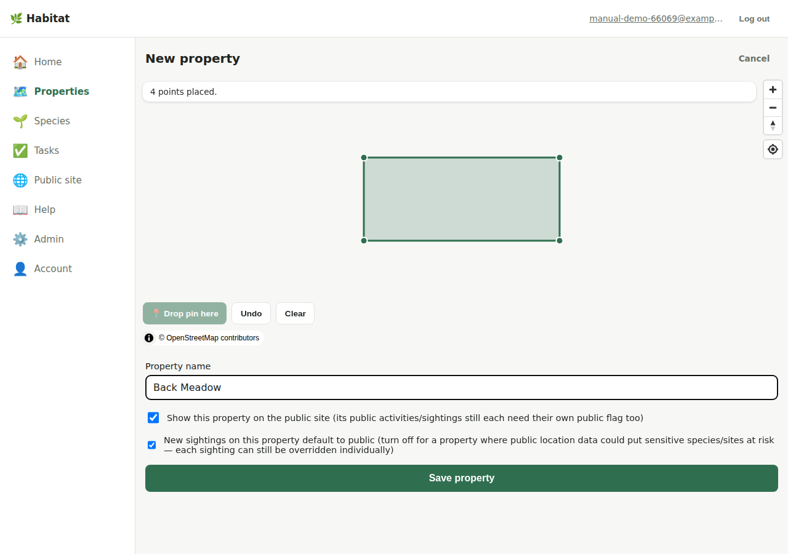
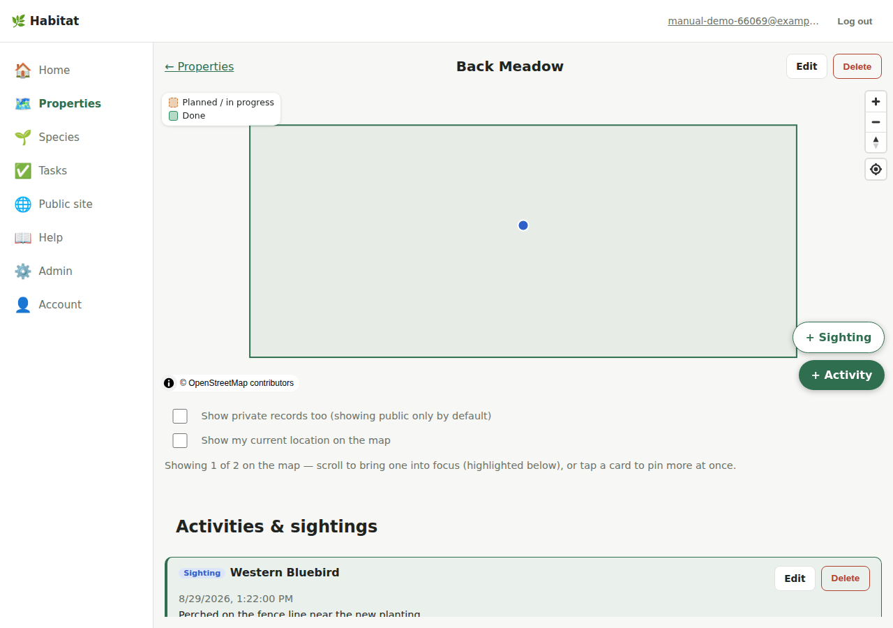

# Properties

A **property** is a piece of land your organization manages — a yard, a
preserve, a parcel. An organization can hold any number of properties.
Activities and sightings are always logged against one property.

## Creating a property

From **Properties**, tap **+ New property** (or the equivalent add
control). You'll land on a map:

- **Draw the boundary** by either tapping points directly on the map, or
  — if your device shares its location — tapping **📍 Drop pin here** to
  drop a vertex at your actual current position. You can mix both freely:
  tap a few points on the map, walk somewhere and drop a pin, tap some
  more. Each placed point shows as a small marker immediately so you get
  feedback even before there are enough points (3+) to preview the filled
  shape.
- **Undo** removes the last point; **Clear** removes them all.
- The boundary is **optional at creation time** — you can save a property
  with just a name and draw the boundary later by editing it.
- **Name** the property.
- **Public URL name** (shown only when *editing* an existing property) —
  the short, readable part of this property's [public site](public-site.md)
  address, sitting under your organization's own URL name (e.g.
  `/public/willow-creek-preserve/north-meadow`). It's generated
  automatically from the property name, so a new property has a working
  public URL immediately; edit it here (lowercase letters, numbers, and
  hyphens) if you want a different one, or leave it blank when saving to
  regenerate it from the name. Two properties in the same organization
  can't share a URL name.
- **"Show this property on the public site"** — checked by default. This
  is the property-level half of Habitat's public/private control; see
  [Public site](public-site.md) for how it combines with each individual
  activity/sighting's own public flag.
- **"New sightings on this property default to public"** — checked by
  default. Turn this off for a property where public location data could
  put a sensitive or at-risk species/site at risk (e.g. a rare-orchid
  preserve): every *new* sighting logged on that property then starts
  private instead, though it's still just a starting value — each
  sighting keeps its own public/private flag and can always be flipped
  either way when logging or editing it. See [Sightings](sightings.md).

Requires **editor** role or higher. See
[Roles and permissions](roles-and-permissions.md).

## Viewing a property

Tapping a property opens its map page: the drawn boundary, its activities
and sightings (blue) plotted on the map, and two lists below. The map
stays fixed in place at the top of the page while you scroll through the
lists underneath it — you never lose sight of the map while working
through a long list of records. Activities are colored by whether they're
done yet — a small legend on the map explains the two styles:

- **Planned / in progress** — dashed orange outline, light orange fill.
  Anything not marked done, including a custom workflow's in-between
  states (e.g. "In Progress"), gets this styling.
- **Done** — solid green outline, light green fill.

Two toggles above the lists control what's *loaded* in the first place:

- **Show private records too** — by default the map/lists show only
  records marked public; check this to also see private ones. This is
  about what *you* see while logged into your own org's app — separate
  from the public site, which only ever shows public records regardless
  of this toggle.
- **Show my current location on the map** — off by default; turns on a
  "you are here" marker (a different style from the sighting dots, so
  they're not confused) using your device's live location. Off by default
  deliberately, since this is a *viewing* page — the drawing pages
  (below) turn location tracking on automatically instead, since that's
  the whole point of being there.

If the property is public, a collapsible **Public QR code** section below
the toggles generates a scannable code pointing at this property's public
page — press **Generate QR code**, then **Download PNG**, and optionally
embed a **Center image** (e.g. a logo) first, the same as the
organization-level code on the [org admin page](organization-admin.md#public-qr-code).
It only appears for a property that's marked public (a private property
has no public page to point at).

### Choosing what's plotted on the map

Activities and sightings share one combined list below the map, newest
first (each row is tagged **Activity** or **Sighting**) — rather than
plotting everything on the map at once, the map shows whichever single
record you've scrolled into focus: as you scroll the list, the record
currently under the highlighted (colored-background) card is the one
drawn on the map, and the highlight moves with it. A hint line above the
list ("Showing X of Y on the map") tracks this.

To show more than one record at a time — e.g. comparing a few plantings
across the property — tap/press anywhere on that record's card (its Edit
and Delete buttons are excluded, so those still work normally); a
"📌 Pinned" badge appears on it and it stays shown on the map regardless
of which one is currently scrolled into focus. Tap the card again to
unpin it, or use the **Clear all** button that appears above the list
whenever anything's pinned, to unpin everything at once and go back to
just following the scroll. This only controls what's *drawn on the map*;
it doesn't filter or hide anything from the list itself.

## Editing a property

Editor role or higher can edit a property's name, boundary, and public
flag from the same map-drawing UI described above — it opens already
zoomed to the existing boundary and pre-loads its current points so you
can add to or adjust the shape rather than starting over.

## Deleting a property

Admin role only. Deleting a property **also deletes its activities and
sightings** — you get a confirmation dialog that says so before it
happens. There's no undo.

---

[← Your dashboard](dashboard.md) · [Manual index](README.md) · [Logging activities →](activities.md)
