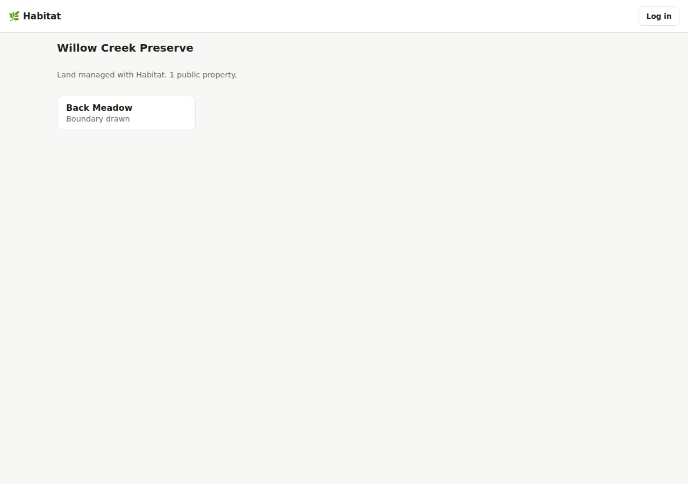
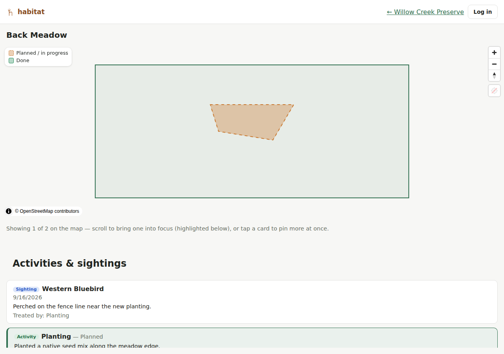

# Public site

Habitat can show a read-only view of an organization's work to anyone,
with no login. This is meant for the "what's happening on this land"
audience — neighbors, land-trust supporters, the curious — separate from
the logged-in app the organization's own members use.

There are two public page shapes, both unauthenticated:

- **Organization portfolio** — `/public/<org-url-name>` — lists every
  property that organization has marked public.
- **Property page** — `/public/<org-url-name>/<property-url-name>` — one
  property's boundary, its public activities, its public sightings, and
  their photos.

Each organization has a short, readable **URL name** (a "slug"), and each
of its properties has one under it — so a preserve's public page reads
`/public/willow-creek-preserve/north-meadow` rather than a numeric ID.
URL names are generated automatically from the organization/property name
when they're created, and an admin can change them (see
[Choosing your public URL name](organization-admin.md#choosing-your-public-url-name)
and a property's own **Public URL name** field on its edit page). The
older numeric-ID URLs (`/public/org/<id>`, `/public/properties/<id>`)
still work, so any link shared before this existed keeps resolving.

From inside the logged-in app, **Public site** in the nav opens your
org's portfolio page in a new tab (a different audience's view, not a
page inside the authed app). The [org admin page](organization-admin.md)
has the same link at the top.

**Organization portfolio page** — lists public properties, no login required:

**Property page** — boundary, a combined activity/sighting list, and a breadcrumb back to the portfolio page:

Like the logged-in property map page, the map stays fixed at the top of
the page while the activity/sighting list below it scrolls — the same
"never lose sight of the map" behavior described there, including the
same combined, newest-first list and scroll-to-focus map selection (see
[Choosing what's plotted on the map](properties.md#choosing-whats-plotted-on-the-map)):
scroll to bring one record into focus on the map, or tap a card to pin
more than one at once. That's a client-only viewing preference, so it's
offered here too even though nothing else on this page is interactive.

A record linked to another (see
[Linking sightings and activities](linking-sightings-activities.md)) shows
that here too, when both sides are public — a sighting shows "Treated
by: …" for any activity it's linked to, and an activity shows "Reported
sightings: …" for any sighting linked to it. A link to a *private* record
on either side never appears here, so a public visitor can't tell a
private sighting/activity even exists via a link to it.

Activities on the map are styled by whether they're done yet — the same
dashed-orange-for-planned/in-progress vs. solid-green-for-done distinction
as the logged-in [property map page](properties.md#viewing-a-property), with
a small legend explaining it. This is the visitor-facing version of that
same planned-vs-completed distinction — a visitor can tell "planned"
apart from "already done" without reading each activity's status text.

## Authored pages and the landing page

The organization portfolio page and each property page described above
are both actually a page called **Explore** — the original, auto-generated
view (property list, or boundary + activity/sighting list) that used to be
the only thing a visitor could see. An editor or admin can now also write
their own pages, at either level:

- From the [org admin page](organization-admin.md)'s **Pages** section —
  org-level pages, shown on the organization portfolio page.
- From a property's own map page's **Pages** section — pages scoped to
  just that property, shown on its property page.

Each page has a title, a URL name (auto-generated from the title, same
convention as an organization/property's own URL name), and a body
written in **Markdown** — headings, bold/italic text, links, lists, and
images. There's no raw-HTML or scripting option: the body is rendered and
sanitized on the server before anyone sees it publicly, so a page can't
carry a script or a broken layout onto the shared public site.

Once you've written a page, a small **page nav** ("Explore" plus every
page you've published) appears at the top of the portfolio/property page,
and you can pick which one visitors land on first — the **Landing page**
dropdown in the same Pages section. Leave it set to Explore (the default,
so nothing changes for an organization that hasn't written any pages) or
pick one of your own pages instead; Explore always stays reachable from
the page nav either way, so switching the landing page never hides it.

A page can be hidden from the public site without deleting it — uncheck
**Visible on the public site** on its edit form. An unpublished page that
was set as the landing page falls back to Explore automatically rather
than breaking the portfolio/property page's own URL.

## What controls whether something shows up

Two independent flags, both of which have to be true for a record to
appear publicly — a property with private activities on it doesn't leak
them, and a public activity on a private property doesn't leak the
property either:

1. **The property's own public flag** — set when
   [creating or editing a property](properties.md), default **on**. A
   property with this off doesn't appear on the org portfolio page at
   all, and its direct public-property URL shows "This property isn't
   public, or doesn't exist" instead of any of its data.
2. **Each activity's / sighting's own public flag** — set individually
   per record, default **on**. Even on a public property, an individual
   activity or sighting marked private is left out of its public page.

This two-level design exists specifically so an organization managing one
public property (say, a preserve) and one private one (say, the manager's
own yard) can keep the private one off the public site entirely, rather
than having to mark every record on it private one at a time.

## What the public site does *not* expose

- A **private or nonexistent** property ID returns the same generic "not
  public, or doesn't exist" message either way — deliberately, so someone
  guessing IDs can't use the response to tell "private" apart from "never
  existed."
- No edit/delete controls, no way to log new activities/sightings, no
  private-records toggle (there's nothing to toggle — the public API only
  ever returns public records to begin with).

---

[← Your account](account.md) · [Manual index](README.md) · [Limitations & known gaps →](limitations.md)
