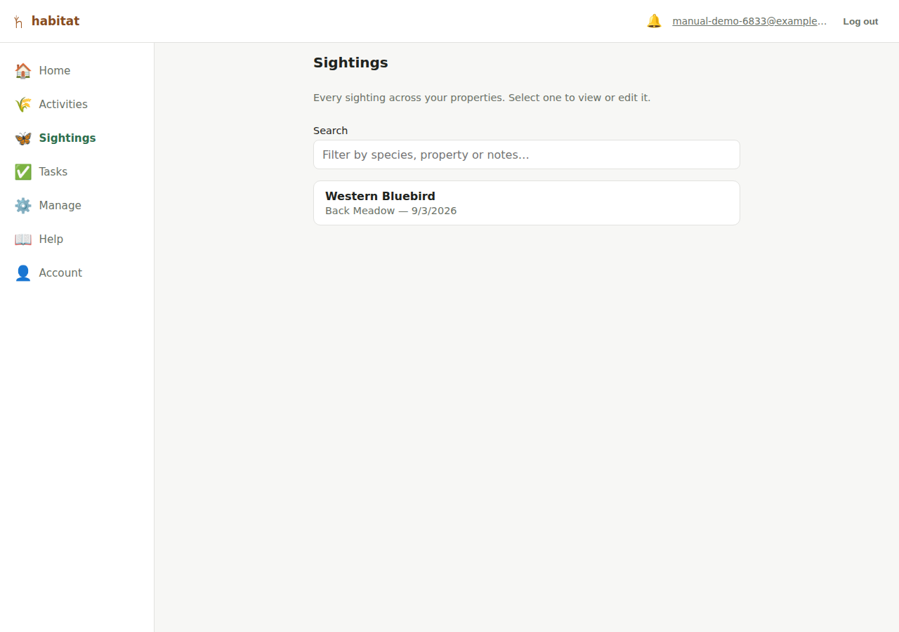

# Logging sightings

A **sighting** is a wildlife observation at a single **point** location —
unlike an activity, it's not an area. Different table, different
lifecycle from an activity (see `/docs/data-model-notes.md` if you want
the underlying data-model reasoning), but the two can be
[linked](linking-sightings-activities.md).

## Creating a sighting

From a property's map page, tap **+ Sighting** (editor role and above).
Set the location either by:

- Tapping the map, or
- **📍 Use my location** — a one-shot capture of your device's current
  position (different from the *continuous* location tracking used while
  drawing a property/activity boundary — a sighting only needs one point,
  so it just grabs your position once).

You can tap the map again afterward to adjust the point.

Fields:

- **Species** — search your organization's [species list](species.md) by
  typing into the field (a type-to-filter picker, not a long dropdown —
  handy once your list has more than a handful of species), or type a
  new common name directly into the "Or add a new species" field to
  create one on the spot (no need to visit the Species page first).
- **Observed at** — date and time; defaults to now.
- **Notes** — free text.
- **Public flag** — same public/private mechanism as a property or
  activity; see [Public site](public-site.md). For a brand-new sighting
  this starts from the property's own default (see
  [Properties](properties.md) — "New sightings on this property default
  to public") rather than always starting checked, though it's always
  yours to change before saving; editing an existing sighting keeps
  whatever it already has.

Photos and linking to activities are edit-mode-only, same as activities —
save the sighting first.

## Finding a sighting

The **Sightings** nav entry lists every sighting across all your
properties, with a **Search** box that matches the species (common or
scientific name), the property name, and the notes. Selecting a row opens
that sighting's edit form.

A sighting logged with no property has no edit form to open (the form
lives under a property), so it appears in the list as a plain row rather
than a link. If your role is [scoped to specific
properties](roles-and-permissions.md), the list shows only those
properties' sightings.

## Editing a sighting

Editor role and above. Same **Photos** section as activities (upload:
editor+; delete: admin only, 8MB/image-type cap) and the same
[linked-activities panel](linking-sightings-activities.md).

## Deleting a sighting

Admin role only, from the property's map page's sighting list — confirm
prompt, no undo.

---

[← Logging activities](activities.md) · [Manual index](README.md) · [Linking sightings and activities →](linking-sightings-activities.md)
