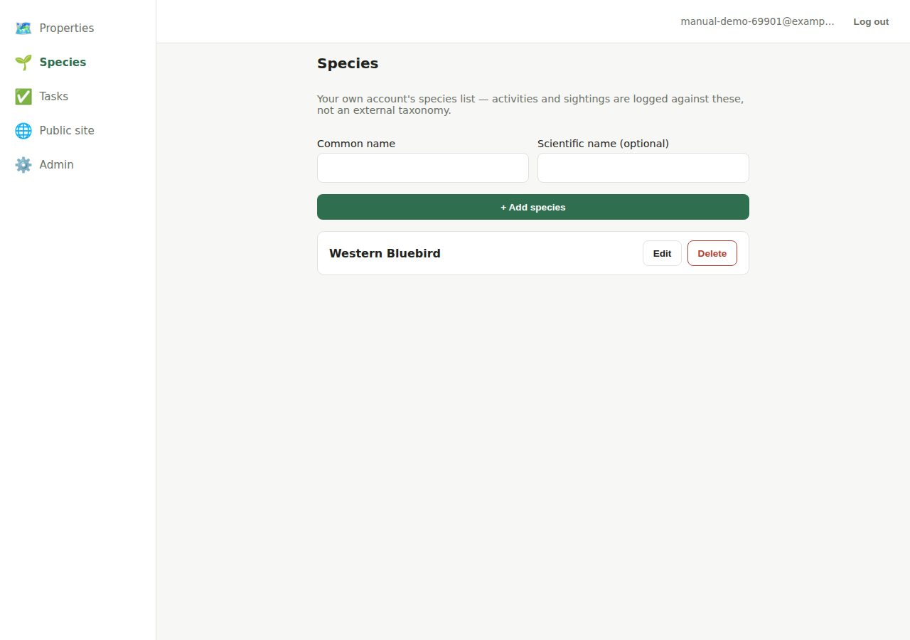

# Species list

Habitat doesn't look species up against an external taxonomy (GBIF, USDA
PLANTS, etc.) — every organization keeps its **own** species list, and
sightings (and eventually activities) are logged against entries on that
list.

## Viewing the list

**Species** in the main nav — every member can view it, regardless of
role.

## Adding a species

Editor role and above: a common name (required) and scientific name
(optional) at the top of the page. You don't have to come here first,
either — the [sighting form](sightings.md) lets you type a brand-new
common name directly while logging a sighting, which creates the species
entry on the spot.

## Editing or deleting a species

- **Edit** (common name, scientific name) — editor role and above, inline
  on each row.
- **Delete** — admin role only, with a confirm prompt.

There's no merge/dedupe tool if two similar entries get created by
accident (e.g. via the quick-add-while-logging-a-sighting path) — you'd
need to edit one and manually reassign or delete the other by hand today.
