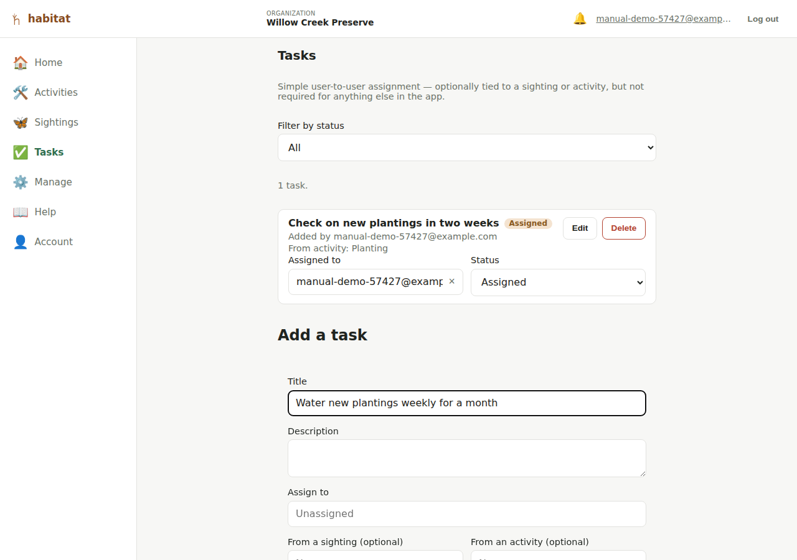

# Tasks

A **task** is a simple, optional, user-to-user to-do — "check out the
bindweed report" — assignable to any member of your organization. Unlike
activities and sightings, a task is **organization-wide**, not tied to one
property; that's why it gets its own top-level nav entry ("Tasks") rather
than living inside a property's map page.

A task can optionally originate from a specific sighting or activity (any
one of the org's properties, not just one), or from nothing at all — a
general to-do isn't required to reference anything.

## Viewing tasks

Every member can see the full task list, with a status filter (Open,
Assigned, Resolved, Dismissed).

## Creating a task

Editor role and above, via the **+ Add task** form at the bottom of the
page: title (required), description, an assignee (or leave unassigned),
and optionally a sighting or activity it originated from. The assignee
and sighting/activity fields are search boxes (type to filter your
organization's member list or record list) rather than long dropdowns —
handy once either list has grown past a handful of entries. Assigning it
to someone on creation automatically sets its status to "Assigned";
leaving it unassigned sets it to "Open".

## Updating a task

Editor role and above can, inline on each task row:

- **Reassign it** or set it back to unassigned, via the same search-box
  picker — applies immediately, no separate save step.
- **Change its status** the same way.
- **Edit its title/description** via an Edit toggle that opens a small
  inline form.

A member below editor role sees the task's current assignee/status as
plain text instead of the editable controls.

## Deleting a task

Admin role only.

## Notifications

Assigning (or reassigning) a task to someone now notifies them — a 🔔
bell in the top bar shows an unread-count badge, and opening it lists
recent notifications ("You were assigned the task…"), newest first.
Clicking one marks it read and takes you to the Tasks page; a **Mark all
read** link clears every unread notification at once. Assigning a task to
*yourself* doesn't generate a notification — there's nothing to tell you
that you don't already know. This is in-app only for now (no email or
push); see [Limitations](limitations.md).

## What this doesn't do (yet)

- **No email/push notifications** — see "Notifications" above; only the
  in-app bell exists today.
- **No due dates.**
- Tasks aren't shown anywhere on the [public site](public-site.md) — they're
  an internal coordination tool, not a public record type.

---

[← Species list](species.md) · [Manual index](README.md) · [Roles and permissions →](roles-and-permissions.md)
